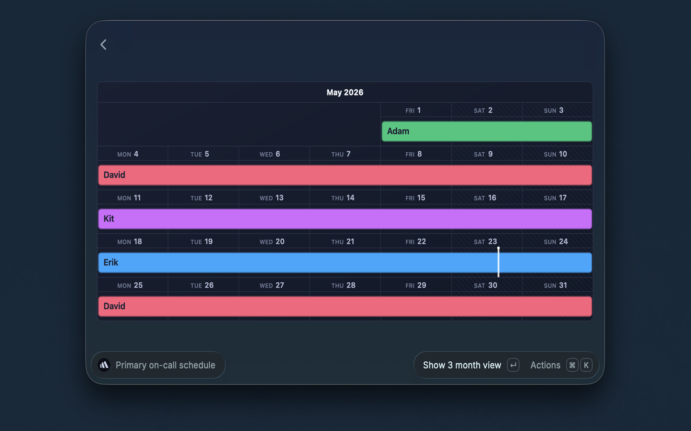

# BetterStack Utils

View your BetterStack on-call primary schedule directly from Raycast.

## Features

- View your BetterStack primary on-call schedule in Raycast.
- Open the schedule directly in BetterStack with the **Open Schedule in Browser** action.

## Setup

This extension requires a BetterStack API token.

1. Go to [BetterStack Global API Tokens](https://betterstack.com/settings/global-api-tokens)
2. Create a new token (or copy an existing one)
3. Paste the token into the **API Token** field when prompted by Raycast

### Open BetterStack in the browser

To enable the **Open Schedule in Browser** action, configure the optional **Team Id** preference in Raycast.

1. Open your on-call schedule in BetterStack.
2. Copy the numeric team ID from the URL: `https://uptime.betterstack.com/team/t{id}/oncalls`
3. Paste only the numeric `{id}` value into the **Team Id** field in this extension's settings.

For example, if your URL is `https://uptime.betterstack.com/team/t12345/oncalls`, enter `12345`.
